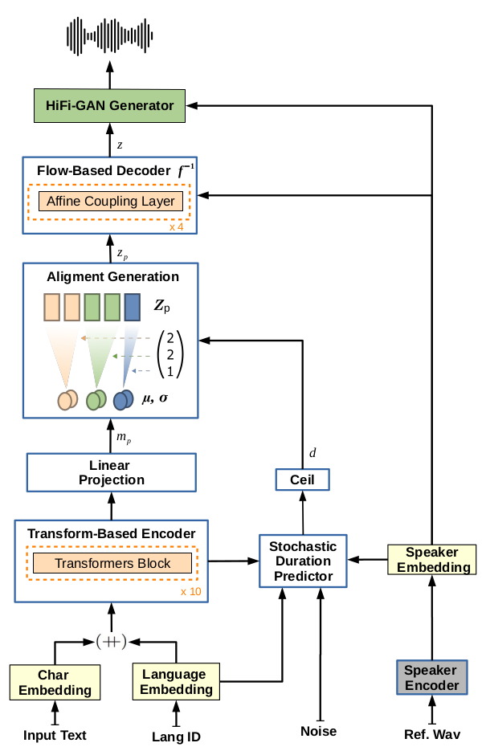

<!DOCTYPE html>
<html lang="pt-br">
  <head>
    <meta charset="UTF-8">
    <title>YourTTS</title>
    <meta name="viewport" content="width=device-width, initial-scale=1">
    <link rel="stylesheet" type="text/css" href="stylesheets/normalize.css" media="screen">
    <link href='https://fonts.googleapis.com/css?family=Open+Sans:400,700' rel='stylesheet' type='text/css'>
    <link rel="shortcut icon" type="image/x-icon" href="favicons/favicon.ico">
    <link rel="stylesheet" type="text/css" href="stylesheets/stylesheet.css" media="screen">
    <link rel="stylesheet" type="text/css" href="stylesheets/github-light.css" media="screen">
  </head>
  <body>
    <section id="page-header" class="page-header">
        

        <canvas id="demo-canvas"></canvas>
        

          <h1 class="project-name"><a href="index.html">YourTTS</a></h1>
          <!-- <h2 class="project-tagline">Sentence Boundary Detection using Deep Learning</h2> -->
          <h2 class="project-tagline">Towards Zero-Shot Multi-Speaker TTS and Zero-Shot Voice Conversion for everyone</h2>
          <!-- <a href="https://github.com/mtreviso/deepbond" class="btn">Ver no GitHub</a> -->
           <!-- 

             <!-- <a href="projeto.html" class="btn">O Projeto</a>
            

              <a href="projeto.html#introducao">Introdução</a>
              <a href="projeto.html#hipoteses">Hipóteses</a>
              <a href="projeto.html#objetivos">Objetivos</a>
              <a href="projeto.html#metodologia">Metodologia</a>
            

          

          

            <a href="ferramenta.html" class="btn">A Ferramenta</a>
            

              <a href="ferramenta.html#instalacao">Como instalar</a>
              <a href="ferramenta.html#uso">Como usar</a>
              <a href="ferramenta.html#treinamento">Como treinar um modelo</a>
            

          

          <a href="recursos.html" class="btn">Recursos</a>
          <a href="pesquisadores.html" class="btn">Pesquisadores</a>
          <a href="publicacoes.html" class="btn">Publicações</a>
          <a href="contato.html" class="btn">Contato</a>-->

        
-->
    </section>

    <section class="main-content">

      

        <a href="https://github.com/Edresson/YourTTS/" class="btn2">• GitHub •</a>
       <a href="https://arxiv.org/abs/2112.02418" class="btn2">• Paper on arXiv •</a></li>
       </li>
       
       <!-- <a href="tutorial.html" class="btn2">• Tutorial •</a>  -->
       <!-- <a href="http://fw.nilc.icmc.usp.br:23680/" target="_blank" class="btn2">• Interface Online •</a> -->
      

         
         
        

          <h2>YourTTS: Towards Zero-Shot Multi-Speaker TTS and Zero-Shot Voice Conversion for everyone</h3>

            
 <b>Edresson Casanova, Julian Weber, Christopher Shulby, Arnaldo Candido Junior, Eren Gölge and  Moacir Antonelli Ponti</b>

        

        

        <h3>Abstract:</h3>

      

           
        YourTTS brings the power of a multilingual approach to the task of zero-shot multi-speaker TTS. Our method builds upon the VITS model and adds several novel modifications for zero-shot multi-speaker and multilingual training. We achieved state-of-the-art (SOTA) results in zero-shot multi-speaker TTS and results comparable to SOTA in zero-shot voice conversion on the VCTK dataset. Additionally, our approach achieves promising results in a target language with a single-speaker dataset, opening possibilities for zero-shot multi-speaker TTS and zero-shot voice conversion systems in low-resource languages. Finally, it is possible to fine-tune the YourTTS model with less than 1 minute of speech and achieve state-of-the-art results in voice similarity and with reasonable quality. This is important to allow synthesis for speakers with a very different voice or recording characteristics from those seen during training.

      

      <h3>System architecture:</h3>

       

    
      <h2>Amostras Spark-TTS</h2>

<table border="1">
<tr><td>Model</td><td colspan="12">Unseen Speakers (test)</td></tr>
<tr>
  <td></td>
 
	<td>p225</td><td>p234</td><td>p238</td><td>p245</td>
	<td>p248</td><td>p261</td><td>p294</td><td>p302</td>
	<td>p326</td><td>p335</td><td>p347</td>
</tr>
</table>

<b>Pasta: female-alc-dub</b>

<table border="1">
  <tr><th>Nome do Arquivo</th><th>Player</th></tr>
  <tr><td>pt_impact_0.wav</td><td><audio controls style="width: 250px;" src="audios_demo/Ermis/audios_gerados_spark_tts/output-enhanced-48khz/female-alc-dub/output/pt_impact_0.wav"></audio></td></tr>
  <tr><td>pt_impact_1.wav</td><td><audio controls style="width: 250px;" src="audios_demo/Ermis/audios_gerados_spark_tts/output-enhanced-48khz/female-alc-dub/output/pt_impact_1.wav"></audio></td></tr>
  <tr><td>pt_impact_10.wav</td><td><audio controls style="width: 250px;" src="audios_demo/Ermis/audios_gerados_spark_tts/output-enhanced-48khz/female-alc-dub/output/pt_impact_10.wav"></audio></td></tr>
  <tr><td>pt_impact_11.wav</td><td><audio controls style="width: 250px;" src="audios_demo/Ermis/audios_gerados_spark_tts/output-enhanced-48khz/female-alc-dub/output/pt_impact_11.wav"></audio></td></tr>
  <tr><td>pt_impact_12.wav</td><td><audio controls style="width: 250px;" src="audios_demo/Ermis/audios_gerados_spark_tts/output-enhanced-48khz/female-alc-dub/output/pt_impact_12.wav"></audio></td></tr>
  <tr><td>pt_impact_13.wav</td><td><audio controls style="width: 250px;" src="audios_demo/Ermis/audios_gerados_spark_tts/output-enhanced-48khz/female-alc-dub/output/pt_impact_13.wav"></audio></td></tr>
  <tr><td>pt_impact_14.wav</td><td><audio controls style="width: 250px;" src="audios_demo/Ermis/audios_gerados_spark_tts/output-enhanced-48khz/female-alc-dub/output/pt_impact_14.wav"></audio></td></tr>
  <tr><td>pt_impact_2.wav</td><td><audio controls style="width: 250px;" src="audios_demo/Ermis/audios_gerados_spark_tts/output-enhanced-48khz/female-alc-dub/output/pt_impact_2.wav"></audio></td></tr>
  <tr><td>pt_impact_3.wav</td><td><audio controls style="width: 250px;" src="audios_demo/Ermis/audios_gerados_spark_tts/output-enhanced-48khz/female-alc-dub/output/pt_impact_3.wav"></audio></td></tr>
  <tr><td>pt_impact_4.wav</td><td><audio controls style="width: 250px;" src="audios_demo/Ermis/audios_gerados_spark_tts/output-enhanced-48khz/female-alc-dub/output/pt_impact_4.wav"></audio></td></tr>
  <tr><td>pt_impact_5.wav</td><td><audio controls style="width: 250px;" src="audios_demo/Ermis/audios_gerados_spark_tts/output-enhanced-48khz/female-alc-dub/output/pt_impact_5.wav"></audio></td></tr>
  <tr><td>pt_impact_6.wav</td><td><audio controls style="width: 250px;" src="audios_demo/Ermis/audios_gerados_spark_tts/output-enhanced-48khz/female-alc-dub/output/pt_impact_6.wav"></audio></td></tr>
  <tr><td>pt_impact_7.wav</td><td><audio controls style="width: 250px;" src="audios_demo/Ermis/audios_gerados_spark_tts/output-enhanced-48khz/female-alc-dub/output/pt_impact_7.wav"></audio></td></tr>
  <tr><td>pt_impact_8.wav</td><td><audio controls style="width: 250px;" src="audios_demo/Ermis/audios_gerados_spark_tts/output-enhanced-48khz/female-alc-dub/output/pt_impact_8.wav"></audio></td></tr>
  <tr><td>pt_impact_9.wav</td><td><audio controls style="width: 250px;" src="audios_demo/Ermis/audios_gerados_spark_tts/output-enhanced-48khz/female-alc-dub/output/pt_impact_9.wav"></audio></td></tr>
  <tr><td>pt_sad_0.wav</td><td><audio controls style="width: 250px;" src="audios_demo/Ermis/audios_gerados_spark_tts/output-enhanced-48khz/female-alc-dub/output/pt_sad_0.wav"></audio></td></tr>
  <tr><td>pt_sad_1.wav</td><td><audio controls style="width: 250px;" src="audios_demo/Ermis/audios_gerados_spark_tts/output-enhanced-48khz/female-alc-dub/output/pt_sad_1.wav"></audio></td></tr>
  <tr><td>pt_sad_10.wav</td><td><audio controls style="width: 250px;" src="audios_demo/Ermis/audios_gerados_spark_tts/output-enhanced-48khz/female-alc-dub/output/pt_sad_10.wav"></audio></td></tr>
  <tr><td>pt_sad_11.wav</td><td><audio controls style="width: 250px;" src="audios_demo/Ermis/audios_gerados_spark_tts/output-enhanced-48khz/female-alc-dub/output/pt_sad_11.wav"></audio></td></tr>
  <tr><td>pt_sad_12.wav</td><td><audio controls style="width: 250px;" src="audios_demo/Ermis/audios_gerados_spark_tts/output-enhanced-48khz/female-alc-dub/output/pt_sad_12.wav"></audio></td></tr>
  <tr><td>pt_sad_13.wav</td><td><audio controls style="width: 250px;" src="audios_demo/Ermis/audios_gerados_spark_tts/output-enhanced-48khz/female-alc-dub/output/pt_sad_13.wav"></audio></td></tr>
  <tr><td>pt_sad_14.wav</td><td><audio controls style="width: 250px;" src="audios_demo/Ermis/audios_gerados_spark_tts/output-enhanced-48khz/female-alc-dub/output/pt_sad_14.wav"></audio></td></tr>
  <tr><td>pt_sad_2.wav</td><td><audio controls style="width: 250px;" src="audios_demo/Ermis/audios_gerados_spark_tts/output-enhanced-48khz/female-alc-dub/output/pt_sad_2.wav"></audio></td></tr>
  <tr><td>pt_sad_3.wav</td><td><audio controls style="width: 250px;" src="audios_demo/Ermis/audios_gerados_spark_tts/output-enhanced-48khz/female-alc-dub/output/pt_sad_3.wav"></audio></td></tr>
  <tr><td>pt_sad_4.wav</td><td><audio controls style="width: 250px;" src="audios_demo/Ermis/audios_gerados_spark_tts/output-enhanced-48khz/female-alc-dub/output/pt_sad_4.wav"></audio></td></tr>
  <tr><td>pt_sad_5.wav</td><td><audio controls style="width: 250px;" src="audios_demo/Ermis/audios_gerados_spark_tts/output-enhanced-48khz/female-alc-dub/output/pt_sad_5.wav"></audio></td></tr>
  <tr><td>pt_sad_6.wav</td><td><audio controls style="width: 250px;" src="audios_demo/Ermis/audios_gerados_spark_tts/output-enhanced-48khz/female-alc-dub/output/pt_sad_6.wav"></audio></td></tr>
  <tr><td>pt_sad_7.wav</td><td><audio controls style="width: 250px;" src="audios_demo/Ermis/audios_gerados_spark_tts/output-enhanced-48khz/female-alc-dub/output/pt_sad_7.wav"></audio></td></tr>
  <tr><td>pt_sad_8.wav</td><td><audio controls style="width: 250px;" src="audios_demo/Ermis/audios_gerados_spark_tts/output-enhanced-48khz/female-alc-dub/output/pt_sad_8.wav"></audio></td></tr>
  <tr><td>pt_sad_9.wav</td><td><audio controls style="width: 250px;" src="audios_demo/Ermis/audios_gerados_spark_tts/output-enhanced-48khz/female-alc-dub/output/pt_sad_9.wav"></audio></td></tr>
</table>

<b>Pasta: female-alc-dub-2</b>

<table border="1">
  <tr><th>Nome do Arquivo</th><th>Player</th></tr>
  <tr><td>pt_impact_0.wav</td><td><audio controls style="width: 250px;" src="audios_demo/Ermis/audios_gerados_spark_tts/output-enhanced-48khz/female-alc-dub-2/output/pt_impact_0.wav"></audio></td></tr>
  <tr><td>pt_impact_1.wav</td><td><audio controls style="width: 250px;" src="audios_demo/Ermis/audios_gerados_spark_tts/output-enhanced-48khz/female-alc-dub-2/output/pt_impact_1.wav"></audio></td></tr>
  <tr><td>pt_impact_10.wav</td><td><audio controls style="width: 250px;" src="audios_demo/Ermis/audios_gerados_spark_tts/output-enhanced-48khz/female-alc-dub-2/output/pt_impact_10.wav"></audio></td></tr>
  <tr><td>pt_impact_11.wav</td><td><audio controls style="width: 250px;" src="audios_demo/Ermis/audios_gerados_spark_tts/output-enhanced-48khz/female-alc-dub-2/output/pt_impact_11.wav"></audio></td></tr>
  <tr><td>pt_impact_12.wav</td><td><audio controls style="width: 250px;" src="audios_demo/Ermis/audios_gerados_spark_tts/output-enhanced-48khz/female-alc-dub-2/output/pt_impact_12.wav"></audio></td></tr>
  <tr><td>pt_impact_13.wav</td><td><audio controls style="width: 250px;" src="audios_demo/Ermis/audios_gerados_spark_tts/output-enhanced-48khz/female-alc-dub-2/output/pt_impact_13.wav"></audio></td></tr>
  <tr><td>pt_impact_14.wav</td><td><audio controls style="width: 250px;" src="audios_demo/Ermis/audios_gerados_spark_tts/output-enhanced-48khz/female-alc-dub-2/output/pt_impact_14.wav"></audio></td></tr>
  <tr><td>pt_impact_2.wav</td><td><audio controls style="width: 250px;" src="audios_demo/Ermis/audios_gerados_spark_tts/output-enhanced-48khz/female-alc-dub-2/output/pt_impact_2.wav"></audio></td></tr>
  <tr><td>pt_impact_3.wav</td><td><audio controls style="width: 250px;" src="audios_demo/Ermis/audios_gerados_spark_tts/output-enhanced-48khz/female-alc-dub-2/output/pt_impact_3.wav"></audio></td></tr>
  <tr><td>pt_impact_4.wav</td><td><audio controls style="width: 250px;" src="audios_demo/Ermis/audios_gerados_spark_tts/output-enhanced-48khz/female-alc-dub-2/output/pt_impact_4.wav"></audio></td></tr>
  <tr><td>pt_impact_5.wav</td><td><audio controls style="width: 250px;" src="audios_demo/Ermis/audios_gerados_spark_tts/output-enhanced-48khz/female-alc-dub-2/output/pt_impact_5.wav"></audio></td></tr>
  <tr><td>pt_impact_6.wav</td><td><audio controls style="width: 250px;" src="audios_demo/Ermis/audios_gerados_spark_tts/output-enhanced-48khz/female-alc-dub-2/output/pt_impact_6.wav"></audio></td></tr>
  <tr><td>pt_impact_7.wav</td><td><audio controls style="width: 250px;" src="audios_demo/Ermis/audios_gerados_spark_tts/output-enhanced-48khz/female-alc-dub-2/output/pt_impact_7.wav"></audio></td></tr>
  <tr><td>pt_impact_8.wav</td><td><audio controls style="width: 250px;" src="audios_demo/Ermis/audios_gerados_spark_tts/output-enhanced-48khz/female-alc-dub-2/output/pt_impact_8.wav"></audio></td></tr>
  <tr><td>pt_impact_9.wav</td><td><audio controls style="width: 250px;" src="audios_demo/Ermis/audios_gerados_spark_tts/output-enhanced-48khz/female-alc-dub-2/output/pt_impact_9.wav"></audio></td></tr>
  <tr><td>pt_sad_0.wav</td><td><audio controls style="width: 250px;" src="audios_demo/Ermis/audios_gerados_spark_tts/output-enhanced-48khz/female-alc-dub-2/output/pt_sad_0.wav"></audio></td></tr>
  <tr><td>pt_sad_1.wav</td><td><audio controls style="width: 250px;" src="audios_demo/Ermis/audios_gerados_spark_tts/output-enhanced-48khz/female-alc-dub-2/output/pt_sad_1.wav"></audio></td></tr>
  <tr><td>pt_sad_10.wav</td><td><audio controls style="width: 250px;" src="audios_demo/Ermis/audios_gerados_spark_tts/output-enhanced-48khz/female-alc-dub-2/output/pt_sad_10.wav"></audio></td></tr>
  <tr><td>pt_sad_11.wav</td><td><audio controls style="width: 250px;" src="audios_demo/Ermis/audios_gerados_spark_tts/output-enhanced-48khz/female-alc-dub-2/output/pt_sad_11.wav"></audio></td></tr>
  <tr><td>pt_sad_12.wav</td><td><audio controls style="width: 250px;" src="audios_demo/Ermis/audios_gerados_spark_tts/output-enhanced-48khz/female-alc-dub-2/output/pt_sad_12.wav"></audio></td></tr>
  <tr><td>pt_sad_13.wav</td><td><audio controls style="width: 250px;" src="audios_demo/Ermis/audios_gerados_spark_tts/output-enhanced-48khz/female-alc-dub-2/output/pt_sad_13.wav"></audio></td></tr>
  <tr><td>pt_sad_14.wav</td><td><audio controls style="width: 250px;" src="audios_demo/Ermis/audios_gerados_spark_tts/output-enhanced-48khz/female-alc-dub-2/output/pt_sad_14.wav"></audio></td></tr>
  <tr><td>pt_sad_2.wav</td><td><audio controls style="width: 250px;" src="audios_demo/Ermis/audios_gerados_spark_tts/output-enhanced-48khz/female-alc-dub-2/output/pt_sad_2.wav"></audio></td></tr>
  <tr><td>pt_sad_3.wav</td><td><audio controls style="width: 250px;" src="audios_demo/Ermis/audios_gerados_spark_tts/output-enhanced-48khz/female-alc-dub-2/output/pt_sad_3.wav"></audio></td></tr>
  <tr><td>pt_sad_4.wav</td><td><audio controls style="width: 250px;" src="audios_demo/Ermis/audios_gerados_spark_tts/output-enhanced-48khz/female-alc-dub-2/output/pt_sad_4.wav"></audio></td></tr>
  <tr><td>pt_sad_5.wav</td><td><audio controls style="width: 250px;" src="audios_demo/Ermis/audios_gerados_spark_tts/output-enhanced-48khz/female-alc-dub-2/output/pt_sad_5.wav"></audio></td></tr>
  <tr><td>pt_sad_6.wav</td><td><audio controls style="width: 250px;" src="audios_demo/Ermis/audios_gerados_spark_tts/output-enhanced-48khz/female-alc-dub-2/output/pt_sad_6.wav"></audio></td></tr>
  <tr><td>pt_sad_7.wav</td><td><audio controls style="width: 250px;" src="audios_demo/Ermis/audios_gerados_spark_tts/output-enhanced-48khz/female-alc-dub-2/output/pt_sad_7.wav"></audio></td></tr>
  <tr><td>pt_sad_8.wav</td><td><audio controls style="width: 250px;" src="audios_demo/Ermis/audios_gerados_spark_tts/output-enhanced-48khz/female-alc-dub-2/output/pt_sad_8.wav"></audio></td></tr>
  <tr><td>pt_sad_9.wav</td><td><audio controls style="width: 250px;" src="audios_demo/Ermis/audios_gerados_spark_tts/output-enhanced-48khz/female-alc-dub-2/output/pt_sad_9.wav"></audio></td></tr>
</table>

<b>Pasta: male-alc-dub</b>

<table border="1">
  <tr><th>Nome do Arquivo</th><th>Player</th></tr>
  <tr><td>pt_mid_long_0.wav</td><td><audio controls style="width: 250px;" src="audios_demo/Ermis/audios_gerados_spark_tts/output-enhanced-48khz/male-alc-dub/output/pt_mid_long_0.wav"></audio></td></tr>
  <tr><td>pt_mid_long_1.wav</td><td><audio controls style="width: 250px;" src="audios_demo/Ermis/audios_gerados_spark_tts/output-enhanced-48khz/male-alc-dub/output/pt_mid_long_1.wav"></audio></td></tr>
  <tr><td>pt_mid_long_10.wav</td><td><audio controls style="width: 250px;" src="audios_demo/Ermis/audios_gerados_spark_tts/output-enhanced-48khz/male-alc-dub/output/pt_mid_long_10.wav"></audio></td></tr>
  <tr><td>pt_mid_long_11.wav</td><td><audio controls style="width: 250px;" src="audios_demo/Ermis/audios_gerados_spark_tts/output-enhanced-48khz/male-alc-dub/output/pt_mid_long_11.wav"></audio></td></tr>
  <tr><td>pt_mid_long_12.wav</td><td><audio controls style="width: 250px;" src="audios_demo/Ermis/audios_gerados_spark_tts/output-enhanced-48khz/male-alc-dub/output/pt_mid_long_12.wav"></audio></td></tr>
  <tr><td>pt_mid_long_13.wav</td><td><audio controls style="width: 250px;" src="audios_demo/Ermis/audios_gerados_spark_tts/output-enhanced-48khz/male-alc-dub/output/pt_mid_long_13.wav"></audio></td></tr>
  <tr><td>pt_mid_long_14.wav</td><td><audio controls style="width: 250px;" src="audios_demo/Ermis/audios_gerados_spark_tts/output-enhanced-48khz/male-alc-dub/output/pt_mid_long_14.wav"></audio></td></tr>
  <tr><td>pt_mid_long_15.wav</td><td><audio controls style="width: 250px;" src="audios_demo/Ermis/audios_gerados_spark_tts/output-enhanced-48khz/male-alc-dub/output/pt_mid_long_15.wav"></audio></td></tr>
  <tr><td>pt_mid_long_16.wav</td><td><audio controls style="width: 250px;" src="audios_demo/Ermis/audios_gerados_spark_tts/output-enhanced-48khz/male-alc-dub/output/pt_mid_long_16.wav"></audio></td></tr>
  <tr><td>pt_mid_long_17.wav</td><td><audio controls style="width: 250px;" src="audios_demo/Ermis/audios_gerados_spark_tts/output-enhanced-48khz/male-alc-dub/output/pt_mid_long_17.wav"></audio></td></tr>
  <tr><td>pt_mid_long_18.wav</td><td><audio controls style="width: 250px;" src="audios_demo/Ermis/audios_gerados_spark_tts/output-enhanced-48khz/male-alc-dub/output/pt_mid_long_18.wav"></audio></td></tr>
  <tr><td>pt_mid_long_19.wav</td><td><audio controls style="width: 250px;" src="audios_demo/Ermis/audios_gerados_spark_tts/output-enhanced-48khz/male-alc-dub/output/pt_mid_long_19.wav"></audio></td></tr>
  <tr><td>pt_mid_long_2.wav</td><td><audio controls style="width: 250px;" src="audios_demo/Ermis/audios_gerados_spark_tts/output-enhanced-48khz/male-alc-dub/output/pt_mid_long_2.wav"></audio></td></tr>
  <tr><td>pt_mid_long_3.wav</td><td><audio controls style="width: 250px;" src="audios_demo/Ermis/audios_gerados_spark_tts/output-enhanced-48khz/male-alc-dub/output/pt_mid_long_3.wav"></audio></td></tr>
  <tr><td>pt_mid_long_4.wav</td><td><audio controls style="width: 250px;" src="audios_demo/Ermis/audios_gerados_spark_tts/output-enhanced-48khz/male-alc-dub/output/pt_mid_long_4.wav"></audio></td></tr>
  <tr><td>pt_mid_long_5.wav</td><td><audio controls style="width: 250px;" src="audios_demo/Ermis/audios_gerados_spark_tts/output-enhanced-48khz/male-alc-dub/output/pt_mid_long_5.wav"></audio></td></tr>
  <tr><td>pt_mid_long_6.wav</td><td><audio controls style="width: 250px;" src="audios_demo/Ermis/audios_gerados_spark_tts/output-enhanced-48khz/male-alc-dub/output/pt_mid_long_6.wav"></audio></td></tr>
  <tr><td>pt_mid_long_7.wav</td><td><audio controls style="width: 250px;" src="audios_demo/Ermis/audios_gerados_spark_tts/output-enhanced-48khz/male-alc-dub/output/pt_mid_long_7.wav"></audio></td></tr>
  <tr><td>pt_mid_long_8.wav</td><td><audio controls style="width: 250px;" src="audios_demo/Ermis/audios_gerados_spark_tts/output-enhanced-48khz/male-alc-dub/output/pt_mid_long_8.wav"></audio></td></tr>
  <tr><td>pt_mid_long_9.wav</td><td><audio controls style="width: 250px;" src="audios_demo/Ermis/audios_gerados_spark_tts/output-enhanced-48khz/male-alc-dub/output/pt_mid_long_9.wav"></audio></td></tr>
</table>

<b>Pasta: male-alc-dub-2</b>

<table border="1">
  <tr><th>Nome do Arquivo</th><th>Player</th></tr>
  <tr><td>pt_mid_long_0.wav</td><td><audio controls style="width: 250px;" src="audios_demo/Ermis/audios_gerados_spark_tts/output-enhanced-48khz/male-alc-dub-2/output/pt_mid_long_0.wav"></audio></td></tr>
  <tr><td>pt_mid_long_1.wav</td><td><audio controls style="width: 250px;" src="audios_demo/Ermis/audios_gerados_spark_tts/output-enhanced-48khz/male-alc-dub-2/output/pt_mid_long_1.wav"></audio></td></tr>
  <tr><td>pt_mid_long_10.wav</td><td><audio controls style="width: 250px;" src="audios_demo/Ermis/audios_gerados_spark_tts/output-enhanced-48khz/male-alc-dub-2/output/pt_mid_long_10.wav"></audio></td></tr>
  <tr><td>pt_mid_long_11.wav</td><td><audio controls style="width: 250px;" src="audios_demo/Ermis/audios_gerados_spark_tts/output-enhanced-48khz/male-alc-dub-2/output/pt_mid_long_11.wav"></audio></td></tr>
  <tr><td>pt_mid_long_12.wav</td><td><audio controls style="width: 250px;" src="audios_demo/Ermis/audios_gerados_spark_tts/output-enhanced-48khz/male-alc-dub-2/output/pt_mid_long_12.wav"></audio></td></tr>
  <tr><td>pt_mid_long_13.wav</td><td><audio controls style="width: 250px;" src="audios_demo/Ermis/audios_gerados_spark_tts/output-enhanced-48khz/male-alc-dub-2/output/pt_mid_long_13.wav"></audio></td></tr>
  <tr><td>pt_mid_long_14.wav</td><td><audio controls style="width: 250px;" src="audios_demo/Ermis/audios_gerados_spark_tts/output-enhanced-48khz/male-alc-dub-2/output/pt_mid_long_14.wav"></audio></td></tr>
  <tr><td>pt_mid_long_15.wav</td><td><audio controls style="width: 250px;" src="audios_demo/Ermis/audios_gerados_spark_tts/output-enhanced-48khz/male-alc-dub-2/output/pt_mid_long_15.wav"></audio></td></tr>
  <tr><td>pt_mid_long_16.wav</td><td><audio controls style="width: 250px;" src="audios_demo/Ermis/audios_gerados_spark_tts/output-enhanced-48khz/male-alc-dub-2/output/pt_mid_long_16.wav"></audio></td></tr>
  <tr><td>pt_mid_long_17.wav</td><td><audio controls style="width: 250px;" src="audios_demo/Ermis/audios_gerados_spark_tts/output-enhanced-48khz/male-alc-dub-2/output/pt_mid_long_17.wav"></audio></td></tr>
  <tr><td>pt_mid_long_18.wav</td><td><audio controls style="width: 250px;" src="audios_demo/Ermis/audios_gerados_spark_tts/output-enhanced-48khz/male-alc-dub-2/output/pt_mid_long_18.wav"></audio></td></tr>
  <tr><td>pt_mid_long_19.wav</td><td><audio controls style="width: 250px;" src="audios_demo/Ermis/audios_gerados_spark_tts/output-enhanced-48khz/male-alc-dub-2/output/pt_mid_long_19.wav"></audio></td></tr>
  <tr><td>pt_mid_long_2.wav</td><td><audio controls style="width: 250px;" src="audios_demo/Ermis/audios_gerados_spark_tts/output-enhanced-48khz/male-alc-dub-2/output/pt_mid_long_2.wav"></audio></td></tr>
  <tr><td>pt_mid_long_20.wav</td><td><audio controls style="width: 250px;" src="audios_demo/Ermis/audios_gerados_spark_tts/output-enhanced-48khz/male-alc-dub-2/output/pt_mid_long_20.wav"></audio></td></tr>
  <tr><td>pt_mid_long_21.wav</td><td><audio controls style="width: 250px;" src="audios_demo/Ermis/audios_gerados_spark_tts/output-enhanced-48khz/male-alc-dub-2/output/pt_mid_long_21.wav"></audio></td></tr>
  <tr><td>pt_mid_long_22.wav</td><td><audio controls style="width: 250px;" src="audios_demo/Ermis/audios_gerados_spark_tts/output-enhanced-48khz/male-alc-dub-2/output/pt_mid_long_22.wav"></audio></td></tr>
  <tr><td>pt_mid_long_23.wav</td><td><audio controls style="width: 250px;" src="audios_demo/Ermis/audios_gerados_spark_tts/output-enhanced-48khz/male-alc-dub-2/output/pt_mid_long_23.wav"></audio></td></tr>
  <tr><td>pt_mid_long_24.wav</td><td><audio controls style="width: 250px;" src="audios_demo/Ermis/audios_gerados_spark_tts/output-enhanced-48khz/male-alc-dub-2/output/pt_mid_long_24.wav"></audio></td></tr>
  <tr><td>pt_mid_long_3.wav</td><td><audio controls style="width: 250px;" src="audios_demo/Ermis/audios_gerados_spark_tts/output-enhanced-48khz/male-alc-dub-2/output/pt_mid_long_3.wav"></audio></td></tr>
  <tr><td>pt_mid_long_4.wav</td><td><audio controls style="width: 250px;" src="audios_demo/Ermis/audios_gerados_spark_tts/output-enhanced-48khz/male-alc-dub-2/output/pt_mid_long_4.wav"></audio></td></tr>
  <tr><td>pt_mid_long_5.wav</td><td><audio controls style="width: 250px;" src="audios_demo/Ermis/audios_gerados_spark_tts/output-enhanced-48khz/male-alc-dub-2/output/pt_mid_long_5.wav"></audio></td></tr>
  <tr><td>pt_mid_long_6.wav</td><td><audio controls style="width: 250px;" src="audios_demo/Ermis/audios_gerados_spark_tts/output-enhanced-48khz/male-alc-dub-2/output/pt_mid_long_6.wav"></audio></td></tr>
  <tr><td>pt_mid_long_7.wav</td><td><audio controls style="width: 250px;" src="audios_demo/Ermis/audios_gerados_spark_tts/output-enhanced-48khz/male-alc-dub-2/output/pt_mid_long_7.wav"></audio></td></tr>
  <tr><td>pt_mid_long_8.wav</td><td><audio controls style="width: 250px;" src="audios_demo/Ermis/audios_gerados_spark_tts/output-enhanced-48khz/male-alc-dub-2/output/pt_mid_long_8.wav"></audio></td></tr>
  <tr><td>pt_mid_long_9.wav</td><td><audio controls style="width: 250px;" src="audios_demo/Ermis/audios_gerados_spark_tts/output-enhanced-48khz/male-alc-dub-2/output/pt_mid_long_9.wav"></audio></td></tr>
</table>

<b>Pasta: male-alc-dub-2_2</b>

<table border="1">
  <tr><th>Nome do Arquivo</th><th>Player</th></tr>
  <tr><td>pt_impact_0.wav</td><td><audio controls style="width: 250px;" src="audios_demo/Ermis/audios_gerados_spark_tts/output-enhanced-48khz/male-alc-dub-2_2/output/pt_impact_0.wav"></audio></td></tr>
  <tr><td>pt_impact_1.wav</td><td><audio controls style="width: 250px;" src="audios_demo/Ermis/audios_gerados_spark_tts/output-enhanced-48khz/male-alc-dub-2_2/output/pt_impact_1.wav"></audio></td></tr>
  <tr><td>pt_impact_10.wav</td><td><audio controls style="width: 250px;" src="audios_demo/Ermis/audios_gerados_spark_tts/output-enhanced-48khz/male-alc-dub-2_2/output/pt_impact_10.wav"></audio></td></tr>
  <tr><td>pt_impact_11.wav</td><td><audio controls style="width: 250px;" src="audios_demo/Ermis/audios_gerados_spark_tts/output-enhanced-48khz/male-alc-dub-2_2/output/pt_impact_11.wav"></audio></td></tr>
  <tr><td>pt_impact_12.wav</td><td><audio controls style="width: 250px;" src="audios_demo/Ermis/audios_gerados_spark_tts/output-enhanced-48khz/male-alc-dub-2_2/output/pt_impact_12.wav"></audio></td></tr>
  <tr><td>pt_impact_13.wav</td><td><audio controls style="width: 250px;" src="audios_demo/Ermis/audios_gerados_spark_tts/output-enhanced-48khz/male-alc-dub-2_2/output/pt_impact_13.wav"></audio></td></tr>
  <tr><td>pt_impact_14.wav</td><td><audio controls style="width: 250px;" src="audios_demo/Ermis/audios_gerados_spark_tts/output-enhanced-48khz/male-alc-dub-2_2/output/pt_impact_14.wav"></audio></td></tr>
  <tr><td>pt_impact_2.wav</td><td><audio controls style="width: 250px;" src="audios_demo/Ermis/audios_gerados_spark_tts/output-enhanced-48khz/male-alc-dub-2_2/output/pt_impact_2.wav"></audio></td></tr>
  <tr><td>pt_impact_3.wav</td><td><audio controls style="width: 250px;" src="audios_demo/Ermis/audios_gerados_spark_tts/output-enhanced-48khz/male-alc-dub-2_2/output/pt_impact_3.wav"></audio></td></tr>
  <tr><td>pt_impact_4.wav</td><td><audio controls style="width: 250px;" src="audios_demo/Ermis/audios_gerados_spark_tts/output-enhanced-48khz/male-alc-dub-2_2/output/pt_impact_4.wav"></audio></td></tr>
  <tr><td>pt_impact_5.wav</td><td><audio controls style="width: 250px;" src="audios_demo/Ermis/audios_gerados_spark_tts/output-enhanced-48khz/male-alc-dub-2_2/output/pt_impact_5.wav"></audio></td></tr>
  <tr><td>pt_impact_6.wav</td><td><audio controls style="width: 250px;" src="audios_demo/Ermis/audios_gerados_spark_tts/output-enhanced-48khz/male-alc-dub-2_2/output/pt_impact_6.wav"></audio></td></tr>
  <tr><td>pt_impact_7.wav</td><td><audio controls style="width: 250px;" src="audios_demo/Ermis/audios_gerados_spark_tts/output-enhanced-48khz/male-alc-dub-2_2/output/pt_impact_7.wav"></audio></td></tr>
  <tr><td>pt_impact_8.wav</td><td><audio controls style="width: 250px;" src="audios_demo/Ermis/audios_gerados_spark_tts/output-enhanced-48khz/male-alc-dub-2_2/output/pt_impact_8.wav"></audio></td></tr>
  <tr><td>pt_impact_9.wav</td><td><audio controls style="width: 250px;" src="audios_demo/Ermis/audios_gerados_spark_tts/output-enhanced-48khz/male-alc-dub-2_2/output/pt_impact_9.wav"></audio></td></tr>
</table>

<b>Pasta: male-alc-dub-2_3</b>

<table border="1">
  <tr><th>Nome do Arquivo</th><th>Player</th></tr>
  <tr><td>pt_sad_0.wav</td><td><audio controls style="width: 250px;" src="audios_demo/Ermis/audios_gerados_spark_tts/output-enhanced-48khz/male-alc-dub-2_3/output/pt_sad_0.wav"></audio></td></tr>
  <tr><td>pt_sad_1.wav</td><td><audio controls style="width: 250px;" src="audios_demo/Ermis/audios_gerados_spark_tts/output-enhanced-48khz/male-alc-dub-2_3/output/pt_sad_1.wav"></audio></td></tr>
  <tr><td>pt_sad_10.wav</td><td><audio controls style="width: 250px;" src="audios_demo/Ermis/audios_gerados_spark_tts/output-enhanced-48khz/male-alc-dub-2_3/output/pt_sad_10.wav"></audio></td></tr>
  <tr><td>pt_sad_11.wav</td><td><audio controls style="width: 250px;" src="audios_demo/Ermis/audios_gerados_spark_tts/output-enhanced-48khz/male-alc-dub-2_3/output/pt_sad_11.wav"></audio></td></tr>
  <tr><td>pt_sad_12.wav</td><td><audio controls style="width: 250px;" src="audios_demo/Ermis/audios_gerados_spark_tts/output-enhanced-48khz/male-alc-dub-2_3/output/pt_sad_12.wav"></audio></td></tr>
  <tr><td>pt_sad_13.wav</td><td><audio controls style="width: 250px;" src="audios_demo/Ermis/audios_gerados_spark_tts/output-enhanced-48khz/male-alc-dub-2_3/output/pt_sad_13.wav"></audio></td></tr>
  <tr><td>pt_sad_14.wav</td><td><audio controls style="width: 250px;" src="audios_demo/Ermis/audios_gerados_spark_tts/output-enhanced-48khz/male-alc-dub-2_3/output/pt_sad_14.wav"></audio></td></tr>
  <tr><td>pt_sad_2.wav</td><td><audio controls style="width: 250px;" src="audios_demo/Ermis/audios_gerados_spark_tts/output-enhanced-48khz/male-alc-dub-2_3/output/pt_sad_2.wav"></audio></td></tr>
  <tr><td>pt_sad_3.wav</td><td><audio controls style="width: 250px;" src="audios_demo/Ermis/audios_gerados_spark_tts/output-enhanced-48khz/male-alc-dub-2_3/output/pt_sad_3.wav"></audio></td></tr>
  <tr><td>pt_sad_4.wav</td><td><audio controls style="width: 250px;" src="audios_demo/Ermis/audios_gerados_spark_tts/output-enhanced-48khz/male-alc-dub-2_3/output/pt_sad_4.wav"></audio></td></tr>
  <tr><td>pt_sad_5.wav</td><td><audio controls style="width: 250px;" src="audios_demo/Ermis/audios_gerados_spark_tts/output-enhanced-48khz/male-alc-dub-2_3/output/pt_sad_5.wav"></audio></td></tr>
  <tr><td>pt_sad_6.wav</td><td><audio controls style="width: 250px;" src="audios_demo/Ermis/audios_gerados_spark_tts/output-enhanced-48khz/male-alc-dub-2_3/output/pt_sad_6.wav"></audio></td></tr>
  <tr><td>pt_sad_7.wav</td><td><audio controls style="width: 250px;" src="audios_demo/Ermis/audios_gerados_spark_tts/output-enhanced-48khz/male-alc-dub-2_3/output/pt_sad_7.wav"></audio></td></tr>
  <tr><td>pt_sad_8.wav</td><td><audio controls style="width: 250px;" src="audios_demo/Ermis/audios_gerados_spark_tts/output-enhanced-48khz/male-alc-dub-2_3/output/pt_sad_8.wav"></audio></td></tr>
  <tr><td>pt_sad_9.wav</td><td><audio controls style="width: 250px;" src="audios_demo/Ermis/audios_gerados_spark_tts/output-enhanced-48khz/male-alc-dub-2_3/output/pt_sad_9.wav"></audio></td></tr>
</table>

<b>Pasta: male-alc-dub_2</b>

<table border="1">
  <tr><th>Nome do Arquivo</th><th>Player</th></tr>
  <tr><td>pt_sad_0.wav</td><td><audio controls style="width: 250px;" src="audios_demo/Ermis/audios_gerados_spark_tts/output-enhanced-48khz/male-alc-dub_2/output/pt_sad_0.wav"></audio></td></tr>
  <tr><td>pt_sad_1.wav</td><td><audio controls style="width: 250px;" src="audios_demo/Ermis/audios_gerados_spark_tts/output-enhanced-48khz/male-alc-dub_2/output/pt_sad_1.wav"></audio></td></tr>
  <tr><td>pt_sad_10.wav</td><td><audio controls style="width: 250px;" src="audios_demo/Ermis/audios_gerados_spark_tts/output-enhanced-48khz/male-alc-dub_2/output/pt_sad_10.wav"></audio></td></tr>
  <tr><td>pt_sad_11.wav</td><td><audio controls style="width: 250px;" src="audios_demo/Ermis/audios_gerados_spark_tts/output-enhanced-48khz/male-alc-dub_2/output/pt_sad_11.wav"></audio></td></tr>
  <tr><td>pt_sad_12.wav</td><td><audio controls style="width: 250px;" src="audios_demo/Ermis/audios_gerados_spark_tts/output-enhanced-48khz/male-alc-dub_2/output/pt_sad_12.wav"></audio></td></tr>
  <tr><td>pt_sad_13.wav</td><td><audio controls style="width: 250px;" src="audios_demo/Ermis/audios_gerados_spark_tts/output-enhanced-48khz/male-alc-dub_2/output/pt_sad_13.wav"></audio></td></tr>
  <tr><td>pt_sad_14.wav</td><td><audio controls style="width: 250px;" src="audios_demo/Ermis/audios_gerados_spark_tts/output-enhanced-48khz/male-alc-dub_2/output/pt_sad_14.wav"></audio></td></tr>
  <tr><td>pt_sad_2.wav</td><td><audio controls style="width: 250px;" src="audios_demo/Ermis/audios_gerados_spark_tts/output-enhanced-48khz/male-alc-dub_2/output/pt_sad_2.wav"></audio></td></tr>
  <tr><td>pt_sad_3.wav</td><td><audio controls style="width: 250px;" src="audios_demo/Ermis/audios_gerados_spark_tts/output-enhanced-48khz/male-alc-dub_2/output/pt_sad_3.wav"></audio></td></tr>
  <tr><td>pt_sad_4.wav</td><td><audio controls style="width: 250px;" src="audios_demo/Ermis/audios_gerados_spark_tts/output-enhanced-48khz/male-alc-dub_2/output/pt_sad_4.wav"></audio></td></tr>
  <tr><td>pt_sad_5.wav</td><td><audio controls style="width: 250px;" src="audios_demo/Ermis/audios_gerados_spark_tts/output-enhanced-48khz/male-alc-dub_2/output/pt_sad_5.wav"></audio></td></tr>
  <tr><td>pt_sad_6.wav</td><td><audio controls style="width: 250px;" src="audios_demo/Ermis/audios_gerados_spark_tts/output-enhanced-48khz/male-alc-dub_2/output/pt_sad_6.wav"></audio></td></tr>
  <tr><td>pt_sad_7.wav</td><td><audio controls style="width: 250px;" src="audios_demo/Ermis/audios_gerados_spark_tts/output-enhanced-48khz/male-alc-dub_2/output/pt_sad_7.wav"></audio></td></tr>
  <tr><td>pt_sad_8.wav</td><td><audio controls style="width: 250px;" src="audios_demo/Ermis/audios_gerados_spark_tts/output-enhanced-48khz/male-alc-dub_2/output/pt_sad_8.wav"></audio></td></tr>
  <tr><td>pt_sad_9.wav</td><td><audio controls style="width: 250px;" src="audios_demo/Ermis/audios_gerados_spark_tts/output-enhanced-48khz/male-alc-dub_2/output/pt_sad_9.wav"></audio></td></tr>
</table> 

<h3>Citation</h3>
      <pre class="highlight">
@ARTICLE{2021arXiv211202418C,
  author = {{Casanova}, Edresson and {Weber}, Julian and {Shulby}, Christopher and {Junior}, Arnaldo Candido and {G{\"o}lge}, Eren and {Antonelli Ponti}, Moacir},
  title = "{YourTTS: Towards Zero-Shot Multi-Speaker TTS and Zero-Shot Voice Conversion for everyone}",
  journal = {arXiv e-prints},
  keywords = {Computer Science - Sound, Computer Science - Computation and Language, Electrical Engineering and Systems Science - Audio and Speech Processing},
  year = 2021,
  month = dec,
  eid = {arXiv:2112.02418},
  pages = {arXiv:2112.02418},
  archivePrefix = {arXiv},
  eprint = {2112.02418},
  primaryClass = {cs.SD},
  adsurl = {https://ui.adsabs.harvard.edu/abs/2021arXiv211202418C},
  adsnote = {Provided by the SAO/NASA Astrophysics Data System}
}
      </pre>

     
      <footer class="site-footer">
        
        
        
        
        
        <!---->
          

      </footer>
    

    </section>

    
  
  </body>
</html>
